# Responsive Javascript Quiz Game Applicaion
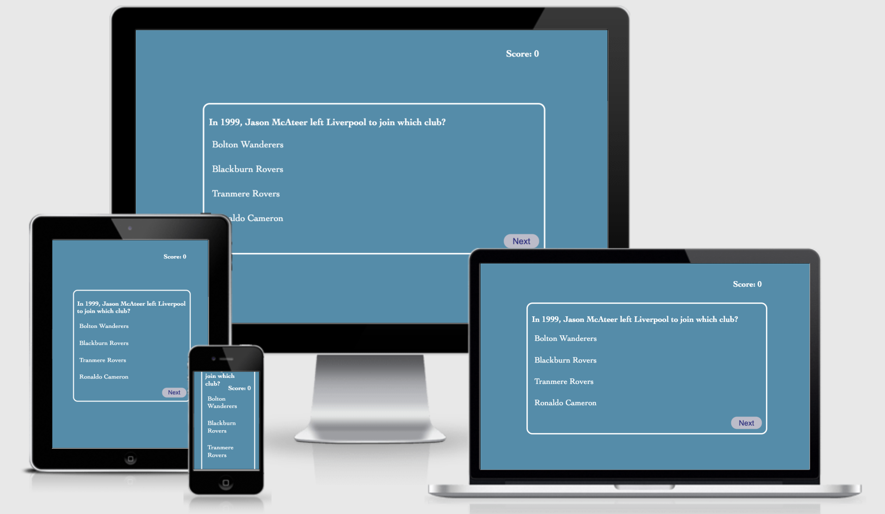

This responsive 5 questions quiz game is designed for user to entertain and education themselves by solving multiple choice question quiz. 

The goal for this app is to educate the user and have the user interact with the app through any device.

# Existing Features

## Landing Page
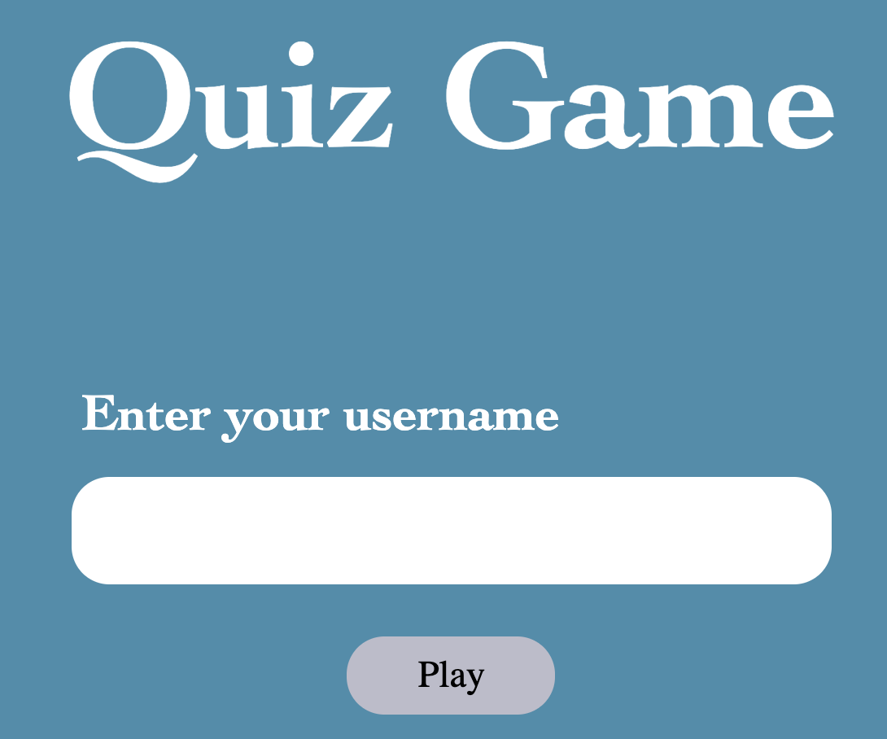
  - Landing page where user is able to input their username and press play to start the quiz

  
  - Hover effect whenever the user hovers over any button on the site

## Quiz Page
 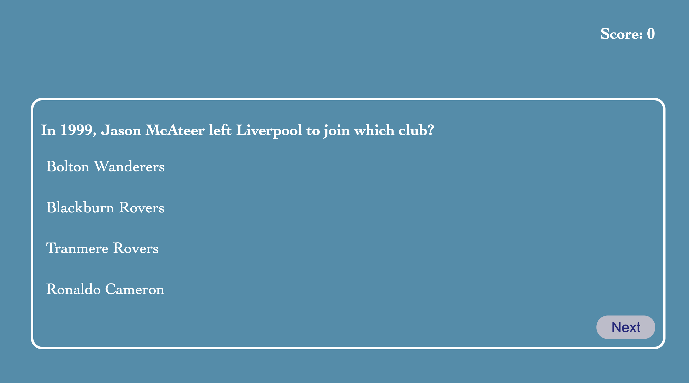
  - Once user inputs their username and clicks the Play button, user will then be redirected to the quiz page
  - Quiz page showcases a score tracking system, question, list of answers, and a next button which takes the user to the next question.

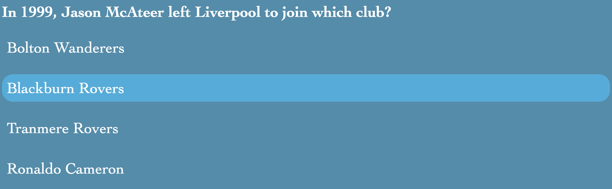
- Hover effect when the user hovers over an answer.

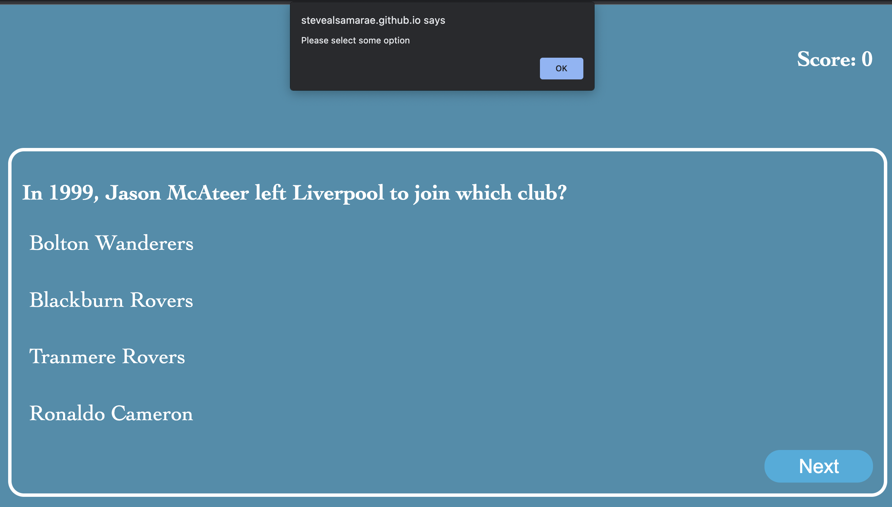
- If user does not click on an answer, and attempts to go to the next question, a warning will pop up asking the user to choose an answer.

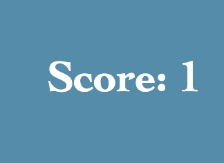
- If user answers the question correctly, a total of 1 will be added to their score.

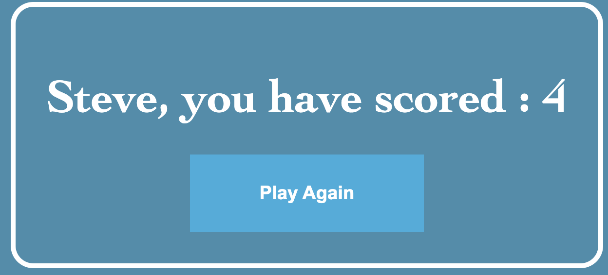
- Once user answers all question, user will then land on total score page, where it indicates the user's name and an automated message with the user's correct answers score.
- A 'Play Again' button, where the user is able to go play the quiz again.

## Features left to implement
   - Database registration system
   - High score system, where users can compete against eachother
   - Different questions when user presses play again
   - Creative design 

## Testings
  All app's features and interactivity function as intended, various testings were conducted.
  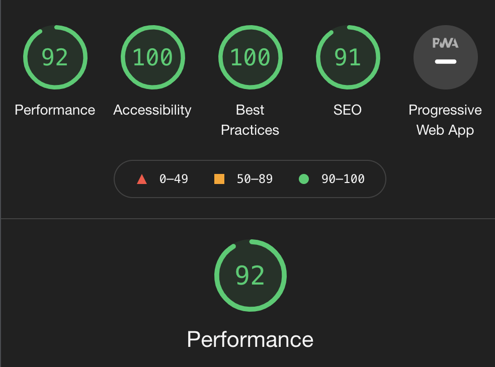

## Validator Testing
- HTML
   - No errors returned when passing through the official [W3C Validator](https://validator.w3.org/)
   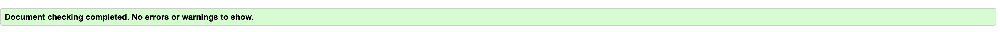

- CSS
  -  No errors returned when passing through the official [Jigsaw Validator](https://jigsaw.w3.org/css-validator/)
  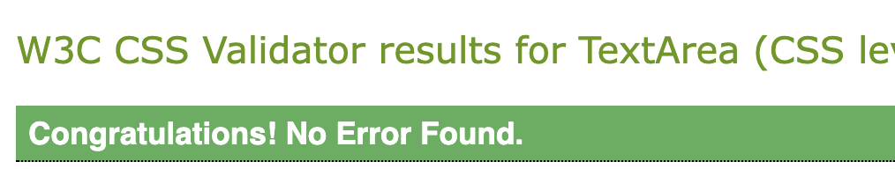

- JS
  - No code breaking warnings were found when passing through [JSHint](https://jshint.com/)

## Unfixed Bugs
None found

## Deployment
The site was deployed to GitHub pages.

- [Live Link](https://stevealsamarae.github.io/Resubmission-MSP2/)

- [Github Repo](https://github.com/SteveAlsamarae/Resubmission-MSP2)

## APP Wireframe 
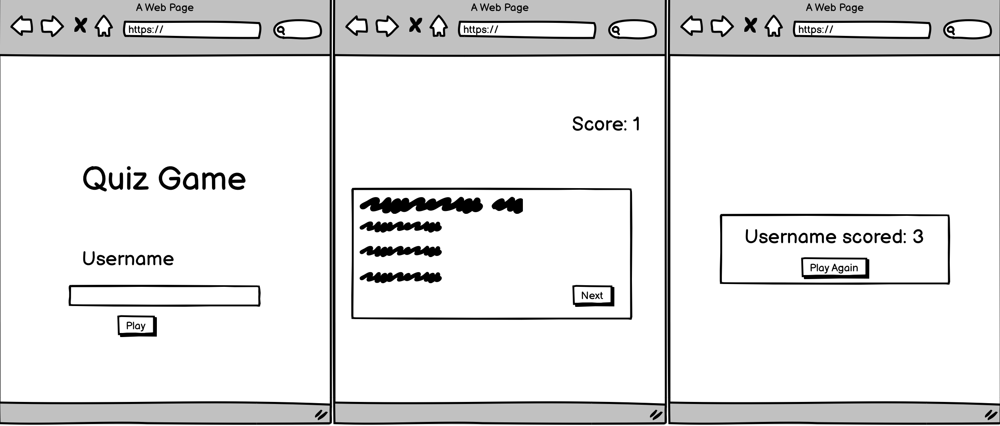 

## Credits
* Credits to Code Institute

* Credits to Code Institute Tutor Support Staff

* Credits to Code Institute Sandeep

* Credits to Udemy

* Credits to W3schools
